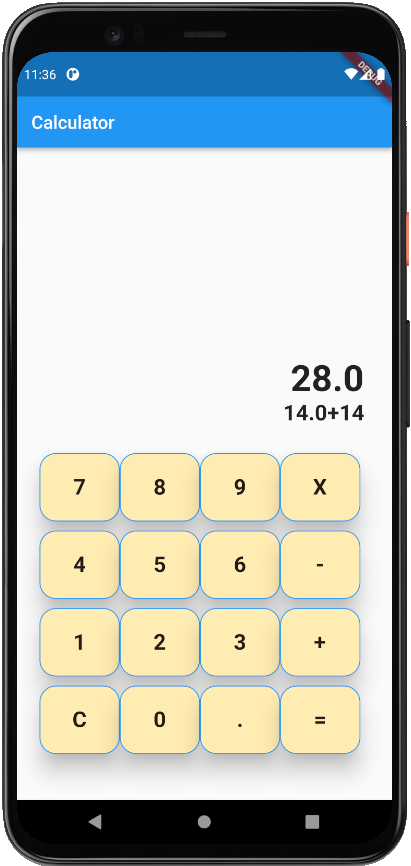

# flutter_calculator

challenge flutter calculator

## Getting Started

This project is a starting point for a Flutter application.

A few resources to get you started if this is your first Flutter project:

- [Lab: Write your first Flutter app](https://flutter.dev/docs/get-started/codelab)
- [Cookbook: Useful Flutter samples](https://flutter.dev/docs/cookbook)

For help getting started with Flutter, view our
[online documentation](https://flutter.dev/docs), which offers tutorials,
samples, guidance on mobile development, and a full API reference.

## Calculator Apps

Simple Calculator App built in Flutter

## Step to set up this project

1. Make sure you already install Flutter [Here](https://flutter.dev/docs/get-started/install)
2. Download or clone this repository
3. You can run either in website or your mobile